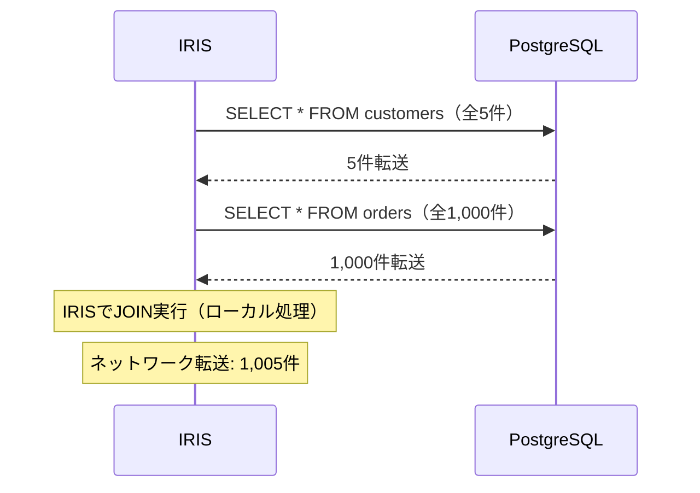
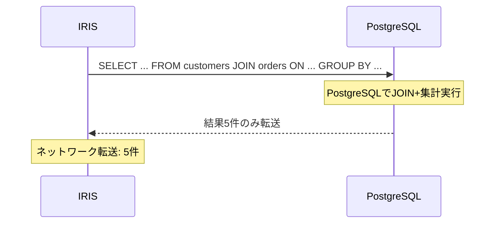

# SQL機能強化

## 概要

2025.3と2026.1では、SQLエンジンが普段の開発・運用で違いを確認しやすい形で強化されました。読みやすくなったクエリプラン、外部テーブルとのJOINを効率的に処理するプッシュダウン、カラムナーストレージの集計最適化、そして大量のSQLを処理するStatement Indexの軽量化です。いずれも手元で動かすと違いが明確に確認できます。このページでは、それぞれを実際に実行しながら確認していきます。

---

### 新クエリプラン形式（2026.1）

クエリプランを確認する際、これまでの擬似XMLは「読めはするが、構造を追うのに手間がかかる」形式でした。2026.1では`$SYSTEM.SQL.Explain()`の出力が刷新され、インデント付きのインラインテキストに変わります。実際に出力を並べると、**モジュールのネスト構造が視覚的に把握できる**点が大きな利点です。さらに集計カラムが`sum(S.Amount)`のように元の名前で表示されるため、どの集計が重いのかを容易に判別できます。**チューニング時のボトルネック特定が大幅に効率化**され、XMLパーサーも不要で、ターミナルやIDEで読んだそのままの形で確認できます。

#### 実行コマンド

IRISターミナルから `$SYSTEM.SQL.Explain()` を実行します。少し複雑なJOIN+集計クエリを渡すと、新形式の読みやすさを確認できます:
```objectscript
do $SYSTEM.SQL.Explain("SELECT p.City, p.Department, COUNT(*) AS TxCount, SUM(s.Amount) AS TotalAmount FROM Demo.Person p JOIN Demo.SalesTransaction s ON p.ID = s.CustomerID WHERE p.Age >= 30 AND s.Amount > 10000 GROUP BY p.City, p.Department ORDER BY TotalAmount DESC")
```

> **注意:** 管理ポータルのSQL実行画面（`EXPLAIN` 文）でもクエリプランを確認できますが、管理ポータルでは出力が改行なしの1行テキストとして表示されるため、従来形式と新形式の違い（インデントやモジュールのネスト構造）を視覚的に比較できません。新旧形式の違いを確認するには、ターミナルから `$SYSTEM.SQL.Explain()` を実行してください。

#### 従来（2025.3以前）の出力結果（擬似XML形式）

<details><summary>クリックで展開</summary>

```xml
<plans>
 <plan>
 <sql>
  SELECT p . City , p . Department , COUNT ( * ) AS TxCount , SUM ( s . Amount ) AS TotalAmount
  FROM Demo . Person p JOIN Demo . SalesTransaction s ON p . ID = s . CustomerID
  WHERE p . Age >= ? AND s . Amount > ?
  GROUP BY p . City , p . Department ORDER BY TotalAmount DESC
 </sql>
 <info>
 This query plan was selected based on the runtime parameter values that led to:
     Improved selectivity estimation of a >= condition on Age and a > condition on Amount.
     Boolean truth value of a NOT NULL condition on arg1 and a NOT NULL condition on arg2.
 </info>
 <cost value="631100"/>
 Call module F, which populates temp-file B.
 Call module J, which populates temp-file C.
 Read temp-file C, looping on sum([value]) and a counter.
 For each row:
     Output the row.
 <module name="F" top="1">
 Divide master map Demo.SalesTransaction(S).IDKEY into subranges of IDs.
 Call module A in parallel on each subrange, piping results into temp-file D.
 Read temp-file D, looping on a counter.
 For each row:
     Check distinct values for %SQLUPPER(City) and %SQLUPPER(Department) using temp-file B,
         subscripted by values.
     For each distinct row:
         Add a row to temp-file B, subscripted by the hash,
             with node data of %SQLUPPER(City) and %SQLUPPER(Department).
     Update the accumulated count([value]) in temp-file B,
         subscripted by the hash
     Update the accumulated sum([value]) in temp-file B,
         subscripted by the hash
 </module>
 <module name="A" top="1">
 Call module B, which populates temp-file A.
 Read temp-file A, looping on the hash subscript.
 For each row:
     Add a row to temp-file D, subscripted by a counter, with node data of
     %SQLUPPER(City), %SQLUPPER(Department), count([value]), and sum([value]).
 </module>
 <module name="B" top="1">
 Read master map Demo.SalesTransaction(S).IDKEY, looping on the subrange of S.ID1.
 For each row:
     Test the > condition on S.Amount and the NOT NULL condition on S.CustomerID.
     Read master map Demo.Person(P).IDKEY, using the given idkey value.
     Test the >= condition on P.Age.
     Check distinct values for %SQLUPPER(City) and %SQLUPPER(Department) using temp-file A,
         subscripted by values.
     For each distinct row:
         Add a row to temp-file A, subscripted by the hash,
             with node data of %SQLUPPER(City), %SQLUPPER(Department), and S.Amount.
     Update the accumulated count([value]) in temp-file A,
         subscripted by the hash
     Update the accumulated sum([value]) in temp-file A,
         subscripted by the hash
 </module>
 </plan>
</plans>
```

</details>

#### 2026.1以降の出力結果（新インラインテキスト形式）

<details><summary>クリックで展開</summary>

```
<plans>
 <plan>
   SQL:
    SELECT p . City , p . Department , COUNT ( * ) AS TxCount , SUM ( s . Amount ) AS TotalAmount
    FROM Demo . Person p JOIN Demo . SalesTransaction s ON p . ID = s . CustomerID
    WHERE p . Age >= ? AND s . Amount > ?
    GROUP BY p . City , p . Department ORDER BY TotalAmount DESC

   Info:
   This query plan was selected based on the runtime parameter values that led to:
       Improved selectivity estimation of a >= condition on Age and a > condition on Amount.
       Boolean truth value of a NOT NULL condition on arg1 and a NOT NULL condition on arg2.

   Cost: 568520

   Module-FIRST:
   Call Module-F.
     Module-F:
     Divide master map Demo.SalesTransaction(S).IDKEY into subranges of IDs.
     Call Module-A in parallel on each subrange, which populates shared temp-file B.
       Module-A:
       Call Module-B.
         Module-B:
         Read master map Demo.SalesTransaction(S).IDKEY, looping on the subrange of S.ID1.
         For each row:
             Test the > condition on S.Amount and the NOT NULL condition on S.CustomerID.
             Read master map Demo.Person(P).IDKEY, using the given idkey value.
             Test the >= condition on P.Age.
               Module-C:
               Check distinct values for %SQLUPPER(City) and %SQLUPPER(Department) using temp-file A,
                   subscripted by values.
               For each distinct row:
                   Add a row to temp-file A, subscripted by the hash,
                       with node data of %SQLUPPER(City), %SQLUPPER(Department), and S.Amount.
             Update the accumulated count(rows) in temp-file A,
                 subscripted by the hash
             Update the accumulated sum(S.Amount) in temp-file A,
                 subscripted by the hash
       Update the accumulated rows in shared temp-file B using temp-file A.
   Call Module-G, which populates temp-file C.
     Module-G:
     Read shared temp-file B, looping on the hash subscript.
     For each row:
         Add a row to temp-file C, subscripted by sum(S.Amount) and a counter,
             with node data of count(rows) and the uncollate expression.
     Module-H:
     Read temp-file C, looping on sum(S.Amount) and a counter.
     For each row:
         Output the row.
 </plan>
</plans>
```

</details>

#### 主な違い

| 項目 | 2025.3以前（従来） | 2026.1（新形式） |
|------|---------------|-----------------|
| モジュール構造 | フラット並列 `<module name="B">` | **ネスト表示** `Module-B:` がインデント |
| コスト表示 | `<cost value="631100"/>` | `Cost: 568520` |
| 集計カラム名 | `count([value])`, `sum([value])` | **`count(rows)`, `sum(S.Amount)`**（元カラム名） |
| 情報ラベル | XMLタグ `<sql>`, `<info>`, `<warning>` | テキストラベル `SQL:`, `Info:`, `Warning:` |

**ポイント:** モジュールがインデントでネストされたことで、`Module-FIRST` → `Module-F` → `Module-A` → `Module-B` という呼び出しチェーンを視覚的にたどれます。集計値も `sum(S.Amount)` のように元カラム名で表示されるため、コストの原因となっている集計を特定しやすく、チューニングの効率が大きく向上します。

#### 活用シーン

- 複雑なJOINクエリのボトルネック箇所を、プランを確認しながら素早く特定したいとき
- DBAやアプリ開発者が、パフォーマンス分析の結果をチームで共有・レビューする場面

---

### SQLソートと IRISTEMP（参考）

大規模な ORDER BY / GROUP BY が発生すると、その一時データは IRISTEMP データベース（テンポラリグローバル）へ自動的に書き出されます。そのため扱えるサイズの実質的な上限は、IRISTEMP のディスク容量に依存します。

ここで関係してくるのが 2025.2 の IRISTEMP スパースファイル廃止です。初期サイズが 240 MB から 20 MB へと縮小され、書き込み I/O の特性も安定したことで、従来の大規模ソート時に発生していた予測困難な I/O スパイクが解消されました。詳細は [パフォーマンス改善](06-performance.md#iristempスパースファイル廃止20252) を参照してください。

#### 活用シーン

- 夜間バッチやレポート生成で実行される大規模ソートを、I/Oスパイクの影響を抑えて安定的に処理したいとき
- IRISTEMP のディスク使用量を見積もり、キャパシティプランニングに反映する場面

---

### Foreign Table JOINプッシュダウン（2025.3）

Foreign Table（外部テーブル）とのJOINで、従来はIRIS側に全データを取得してから結合していた処理を、JOINそのものを外部サーバー側に委ねられるようになりました。結果のみを受け取る方式となるため**ネットワーク転送量が大幅に削減**され、外部DB側のインデックスやオプティマイザも十分に活用されます。これまで負荷が高く現実的でなかった外部DBとの結合クエリも、**実用的な速度**で動作するようになります。以降のシーケンス図で、転送データ量の変化を比較していきます。

#### 従来との違い

**2025.2以前（プッシュダウンなし）:** 各テーブルの全データをIRISに転送してからJOIN



**2025.3以降（プッシュダウンあり）:** JOIN全体をPostgreSQLに送信し、結果のみ返却



| パターン | データ転送量 | 処理時間 |
|---------|-----------|---------|
| プッシュダウンなし（2025.2以前） | 外部テーブル全行をIRISに取得 | 大（ネットワーク+ローカルJOIN） |
| プッシュダウンあり（2025.3以降） | JOIN結果のみ | 小（外部サーバーでJOIN実行） |

外部テーブルが大きく、JOINの結果が小さく絞り込まれるケースほど、この差は顕著になります。1,000件を取得してから結合するか、5件のみを受け取るか。両者の違いは図から明確に確認できます。

#### 実行方法

このリポジトリにはPostgreSQLコンテナ（`demo-postgres`）が同梱されており、説明を読むだけでなく実際に動作を確認できます。PostgreSQLには顧客5件・注文1,000件のサンプルデータが事前に投入済みです。

デモクラス `Demo.SQL.ForeignTableJoin` を両バージョンで実行し、クエリプランの変化を比較します:
```objectscript
do ##class(Demo.SQL.ForeignTableJoin).Run()
```

プッシュダウンが適用されたかどうかは、クエリプランから判別できます。注目すべきキーワードを以下で確認します。

**2025.2以前のクエリプラン抜粋（プッシュダウンなし）:**

> Read foreign table Demo.FT_Customers(C), sending query:<br>
> &emsp;SELECT "id", "name", ... FROM **"customers"** T1<br>
> ...<br>
> Read foreign table Demo.FT_Orders(O), sending query:<br>
> &emsp;SELECT "id", "customer_id", ... FROM **"orders"** T2

→ 各テーブルに**個別のSELECT**が発行され、IRIS側で全件を受け取ってからJOINしていることが確認できます。

**2025.3以降のクエリプラン抜粋（プッシュダウンあり）:**

> Read foreign tables Demo.FT_Customers(C), Demo.FT_Orders(O),<br>
> &emsp;represented as **`pushdown table`** IRIS.SQLFake3(ftfs%1) sending query:<br>
> &emsp;select T1."name", T1."city", count(T2."id"), sum(T2."amount")<br>
> &emsp;FROM ("customers" T1 **`INNER join`** "orders" T2 on (T1."id" = T2."customer_id"))<br>
> &emsp;GROUP BY T1."name", T1."city" ORDER BY C4 DESC

→ プランに **`pushdown table`** と **`INNER join`** が現れていれば、JOINと集計の両方がPostgreSQL側で実行されたことを示します。2025.2以前のプランには各テーブルへの個別SELECTしか出力されず、これらのキーワードは含まれません。このキーワードの有無が、プッシュダウンが適用されているかどうかの判別基準になります。

#### PostgreSQLへの直接接続

外部テーブルの参照先に格納されているデータを確認したい場合は、DBeaverなどのSQLクライアントからPostgreSQLへ直接接続できます:

| 項目 | 値 |
|------|-----|
| Host | `localhost` |
| Port | `11709` |
| Database | `demodb` |
| Username | `demo` |
| Password | `demo` |

投入済みテーブル:
- `customers` — 顧客データ（5件: 田中太郎、鈴木花子、佐藤一郎、山田美咲、渡辺健太）
- `orders` — 注文データ（1,000件: ランダム生成）

#### 活用シーン

- PostgreSQLやMySQLといった外部DBとIRISをまたいで、日常的に結合クエリを発行する場面
- データウェアハウスとOLTPを連携させ、両者のデータを一つのクエリで横断的に扱いたいとき

---

### カラムテーブル低カーディナリティ集計改善（2025.3）

地域コード、ステータス、カテゴリなど、種類が限られた値でのGROUP BYは、BIで頻出する処理パターンです。2025.3では、こうした低カーディナリティ（一意値が少ない）カラムでの集計に、カラムナーストレージ向けの専用最適化パスが追加されました。少数の値でまとめるグルーピングが大幅に高速化され、**BIダッシュボードの応答速度が向上**します。実際に100万行を対象にベンチマークを実行すると、その効果を数値で確認できます。

#### カラムナーストレージテーブルの作成

カラムナーストレージの利用は簡単です。CREATE TABLE に `WITH STORAGETYPE = COLUMNAR` を一行追加するだけで構成できます:

```sql
CREATE TABLE Demo.BenchCol (
    ID INT AUTO_INCREMENT PRIMARY KEY,
    Region VARCHAR(10),
    Status VARCHAR(10),
    Amount DECIMAL(10,2)
) WITH STORAGETYPE = COLUMNAR
```

#### 従来との違い

| 状況 | 2025.2以前 | 2025.3以降 |
|------|-----------|----------|
| 低カーディナリティGROUP BY | 汎用パスで処理（カラムナーの優位性が小さい） | **専用最適化パスで処理**（カラムナーの優位性が顕著） |
| 高カーディナリティGROUP BY | 変化なし | 変化なし |

> カラムナーストレージ自体は2025.2以前から利用可能でした。2025.3で新たに追加されたのは、値の種類が少ない（低カーディナリティ）カラムでのグルーピングに特化した最適化です。

#### 実行コマンドと結果

デモクラス `Demo.SQL.ColumnarBenchmark` を**2025.1と2026.1の両コンテナ**で実行し、出力される数値を比較します:

```objectscript
do ##class(Demo.SQL.ColumnarBenchmark).Run()
```

> **注意:** 20カラム×100万行のサンプルデータ生成と性能計測を行うため、完了まで数分かかります。

デモの構成はシンプルですが、差が生じる理由を確認しやすい設計になっています:
1. **20カラム**のテーブルを行ストレージとカラムナーストレージの両方で用意（各1,000,000行）
2. GROUP BYクエリで参照するのは**3カラムのみ**（Region, Status, Amount）
3. カラムナーストレージでは残り17カラムの読み取りを省略可能。この点が差につながります

#### 期待される結果（2026.1コンテナ）

```
データ準備（20カラム × 1,000,000行）:
  行ストレージ INSERT:        約 14秒
  カラムナーストレージ INSERT: 約172秒

GROUP BY集計ベンチマーク（100回実行）:
  行ストレージ:        43.2 秒
  カラムナーストレージ: 25.2 秒
  → カラムナーは行ストレージの約 1.7 倍高速
```

> **差が出る理由:** 行ストレージは1行全体（20カラム分）をディスクから読み出します。一方カラムナーストレージは、クエリが必要とする3カラム（Region, Status, Amount）のみを読み込み、残り17カラムは読み込みません。読み取るデータ量自体が異なるためです。2025.3の最適化は、この低カーディナリティGROUP BYパターンをさらに改善しています。
>
> 一方、INSERTはカラムナーストレージの方が遅くなります。データをカラムごとに分けて格納する処理が必要なためです。カラムナーストレージは書き込みではなく、**読み取り（分析クエリ）に特化して最適化**された形式と理解してください。

#### 活用シーン

- BIダッシュボードで、地域別・ステータス別といった集計クエリの応答時間を短縮したいとき
- 大規模テーブルに対する定型レポートを、待ち時間を抑えて高速に実行したい場面

---

### SQL Statement Index実行時統計改善（2025.3）

SQLステートメントのコンパイル、キャッシュ登録、ランタイム統計の処理がさらに軽量化されました。普段意識することの少ない内部処理ですが、ユニークなSQLが連続的に発行される環境では、その積み重ねが性能に影響します。結果として**ステートメント処理のスループットが向上**します。1,000本のSQLを処理する時間がどの程度短縮されるか、実測で確認します。

#### 実行方法

デモクラス `Demo.SQL.StatementIndex` を**両バージョン**で実行し、処理時間を比較します:
```objectscript
do ##class(Demo.SQL.StatementIndex).Run()
```

デモは、大量のユニークSQLが発行される状況を再現します:
1. 500個のユニークテーブルを作成（`CREATE TABLE Demo.StmtTest1` 〜 `Demo.StmtTest500`）
2. それぞれに対してSELECTを発行（500個のユニーククエリ）
3. 合計1,000本のユニークSQLステートメントを処理し、所要時間を計測
4. `INFORMATION_SCHEMA.STATEMENTS` に登録されたキャッシュステートメント数を確認
5. `INFORMATION_SCHEMA.STATEMENTS` への全件スキャンクエリの速度を計測

> **注意:** 500テーブルの作成・削除を行うため、完了まで数十秒〜数分かかります。

#### 実測結果

| 項目 | 2025.1 | 2026.1 | 比率 |
|------|--------|--------|------|
| 1,000ステートメント生成時間 | 119.67秒 | 50.30秒 | **2.4倍高速** |
| キャッシュ登録件数 | 1,511件 | 1,514件 | 同等 |
| INFORMATION_SCHEMA全件スキャン（1回平均） | 0.0051秒 | 0.0121秒 | 同等 |

> 実行時間は環境（CPU、ディスク、Docker割当リソース）により異なります。上記はDocker Desktop (Apple Silicon) での参考値です。

#### 考察

- 最も顕著な改善は、**ステートメントの生成・コンパイル・キャッシュ登録**の処理速度です。2025.2以前は1,000本の処理に約120秒を要していたところが、2025.3以降では約50秒となり、約2.4倍の短縮を実現しています。動的SQLが多い環境ほど、この差が体感的な性能に直結します。
- 一方、`INFORMATION_SCHEMA.STATEMENTS`への全件スキャンクエリ自体は、約1,500件規模では目立った差が確認できません。ただしキャッシュステートメントが数万〜数十万件に達する本番環境では、この点でも改善が現れると考えられます。
- BIツールやレポートエンジンが大量のユニーククエリを動的に発行し続ける環境では、この軽量化が継続的に作用し、システム全体の応答性向上に寄与します。

#### 活用シーン

- 動的SQLを大量に組み立てるアプリケーションで、ステートメント処理のスループットを向上させたいとき
- BI/レポートツールがユニーククエリを連続的に発行する環境
- キャッシュステートメントが大量に蓄積された本番環境で、SQLを効率的に管理・分析したい場面
