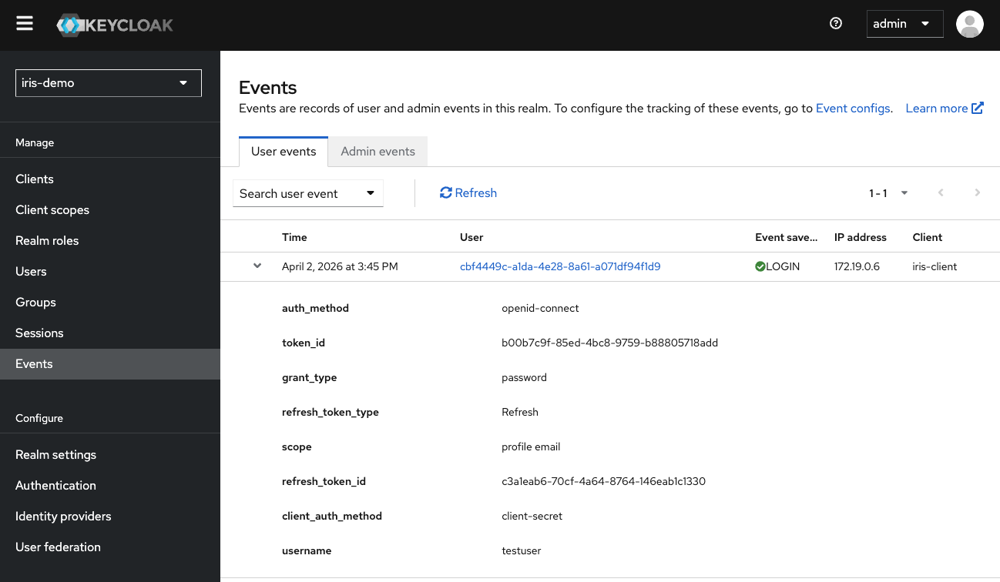
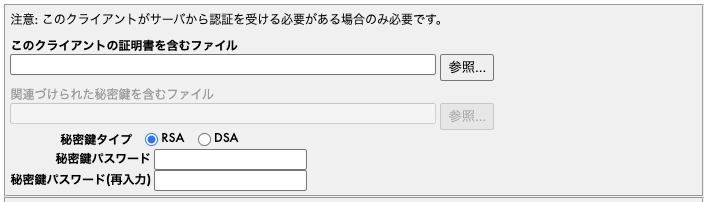
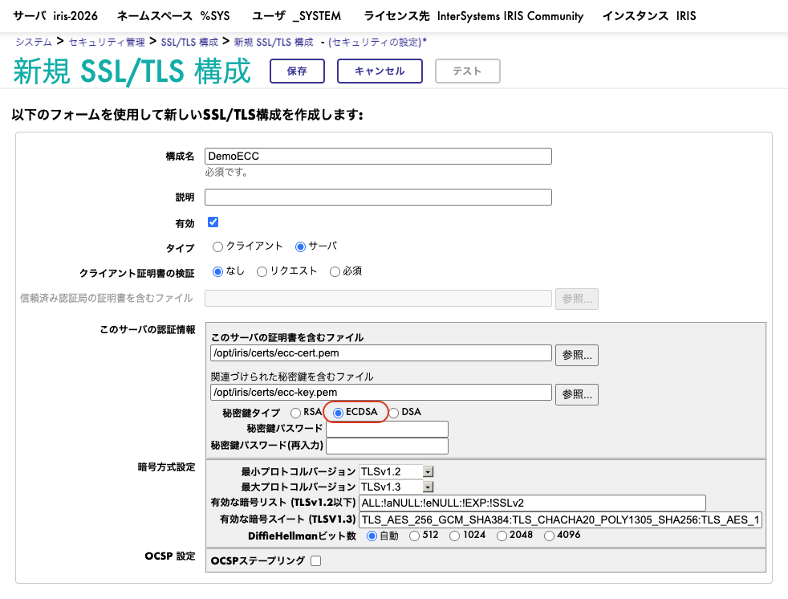

# セキュリティ変更

## 概要

2025.2から2026.1にかけて、IRISのセキュリティ基盤は大きく進化しました。これまでアプリケーション側で工夫して補っていた部分が、プラットフォームの標準機能として組み込まれ、デフォルトで安全な状態を維持しやすくなっています。具体的には、セキュリティデータの独立データベース化（IRISSECURITY）、OAuth2認証のネイティブ統合、ECC証明書のサポート、シークレットを安全に保管するセキュリティウォレット（いずれも2025.2以降）、そしてセキュリティグローバルへの直接アクセス制限（2026.1）です。以降では、それぞれを実際に動作させながら、改善点を順に確認していきます。

---

### IRISSECURITYデータベース（2025.2）

これまでシステムデータと同居していたセキュリティデータ（ユーザー、ロール、リソース定義など）が、IRISSYSから独立した専用の`IRISSECURITY`データベースへと切り出されました。これにより、このデータベース単位で**保存時暗号化（encryption at rest）に対応**できるようになります。万が一ディスクが盗まれたり、バックアップが外部に流出したりしても、ユーザーやロールの情報を平文で読み取られずに済みます。SOC2やHIPAAといった**コンプライアンス要件への対応**でも、「セキュリティデータは暗号化済みです」と明確に説明できるようになります。

#### 確認方法

`%SYS`名前空間でデータベース一覧を表示して、リストに含まれる項目を確認してみましょう:
```objectscript
zn "%SYS"
set rs = ##class(%ResultSet).%New("Config.Databases:List")
do rs.Execute("*")
for  quit:'rs.Next()  write rs.GetData(1),!
```

**実行結果の比較:**

| 2025.1まで | 2025.2以降 |
|-----------|-----------|
| IRISSYS | IRISSYS |
| | **IRISSECURITY** ← 新規追加 |
| IRISLIB | IRISLIB |
| IRISTEMP | IRISTEMP |
| IRISLOCALDATA | IRISLOCALDATA |
| IRISAUDIT | IRISAUDIT |
| IRISMETRICS | IRISMETRICS |
| ENSLIB | ENSLIB |
| USER | USER |

2025.2以降では、リストに **IRISSECURITY** が追加されています。これがセキュリティデータの専用データベースです。特別な設定をしなくても、アップグレードするだけで分離が完了していることが確認できます。

#### 活用シーン

- 監査で「セキュリティデータは暗号化していますか」と問われたとき、データベース単位で即答できる
- バックアップやディスクが外部に渡っても、ユーザー・ロール情報を平文で読み取られない

---

### OAuth2認証改善（2025.2）

OAuth2が、IRISの正式な認証タイプとして追加されました。これまではOAuth2フローを通すために自前のコードを書く必要がありましたが、2026.1（および2025.2以降）では**設定だけで完結**します。Azure ADやOktaを使ったシングルサインオン環境を、より少ない手間で構築できるようになりました。

#### 2025.1までと2025.2以降の違い

2025.1までも、外部IdP（Keycloak、Azure ADなど）からOAuth2トークンを受け取ること自体は可能でした。ただし、そのトークンでIRISのWeb/JDBC接続を認証するには、トークンを検証する**認証クラスを自前で実装する**必要がありました。これがOAuth2導入における大きなハードルとなっていました。

2025.2以降では、以下のクラスが標準で提供され、**カスタムコードを一切書かずにOAuth2認証を構成**できるようになりました:

| クラス | 用途 |
|-------|------|
| `OAuth2.ResourceServer` | リソースサーバーの設定（IdPのURL、クライアント情報等を登録） |
| `%OAuth2.ResourceServer.SimpleAuthenticator` | そのまま使えるサンプル認証クラス（カスタムコード不要） |
| `%OAuth2.ResourceServer.Authenticator` | カスタマイズ用の認証クラスベース |
| `OAuth2.ResourceServer.Mapping` | WebアプリケーションとResourceServerの紐付け |

**2025.1までの構成手順（従来）:**
1. OAuth2クライアント設定を手動作成
2. トークン検証ロジックを含むカスタム認証クラスを**自作**
3. Webアプリケーションにカスタム認証クラスを手動で紐付け
4. JDBC/ODBCではOAuth2トークン認証が**不可**

**2025.2以降の構成手順（改善後）:**
1. `OAuth2.ResourceServer` にIdPのURL・クライアント情報を設定
2. `%OAuth2.ResourceServer.SimpleAuthenticator` をそのまま利用（**コード不要**）
3. 管理ポータルでWebアプリの認証タイプに「OAuth2」を選択するだけ
4. JDBC/ODBCでもアクセストークンを接続プロパティに渡すだけで認証**可能**

```java
// 2025.2以降: JDBC接続でOAuth2トークンを使う例
Properties props = new Properties();
props.put("access_token", "eyJhbGciOiJSUzI1NiIs...");
Connection conn = DriverManager.getConnection(
    "jdbc:IRIS://localhost:1972/USER", props);
// → パスワード不要、トークンだけでDB接続
```

#### コード量の比較: 自前実装 vs 標準クラス

外部IdPから受け取ったOAuth2 Bearerトークンを検証し、IRISユーザーにマッピングする処理を両バージョンで実装すると、必要なコード量は桁違いに変わります。

**2025.1まで: 自前実装で必要だった処理**

トークン検証は文字列の比較で済む処理ではなく、暗号学的に正しい手順を踏む必要があります。アプリケーション側に書かなければならなかった処理は、おおむね次のとおりです:

1. AuthorizationヘッダからBearerトークンを取り出す
2. JWTを `header.payload.signature` の3パートに分解する
3. ヘッダから `kid`（Key ID）と `alg`（署名アルゴリズム）を取得する（`none` アルゴリズム攻撃の防止を含む）
4. IdPのJWKSエンドポイントから公開鍵を取得する（キャッシュTTLの管理も自前）
5. JWK（`n`, `e`）を PEM 形式の公開鍵に変換する（ASN.1 / DER エンコード）
6. 署名検証（RS256: RSA-SHA256 など `alg` に応じた分岐）
7. `exp`（有効期限）の検証
8. `iss`（発行者）の検証
9. `aud`（オーディエンス）の検証（配列形式と単一文字列の両対応）
10. claims からIRISユーザーへのマッピング
11. 401 / 403 を返す一貫したエラー処理

要点となる `OnPreDispatch` の抜粋は次のような形になります:

```objectscript
ClassMethod OnPreDispatch(pUrl, pMethod, ByRef pContinue) As %Status
{
    set pContinue = 0

    // 1. AuthorizationヘッダからBearerトークンを抽出
    set authHeader = %request.GetCgiEnv("HTTP_AUTHORIZATION")
    if ($extract(authHeader, 1, 7) '= "Bearer ") {
        set %response.Status = "401 Unauthorized"  quit $$$OK
    }
    set token = $extract(authHeader, 8, *)

    // 2. JWTを header.payload.signature に分解
    set header = $piece(token, ".", 1), payload = $piece(token, ".", 2), sigPart = $piece(token, ".", 3)
    if (header = "") || (payload = "") || (sigPart = "") {
        set %response.Status = "401 Unauthorized"  quit $$$OK
    }

    // 3. ヘッダから kid / alg を取得（noneアルゴリズム攻撃の防止）
    set headerObj = ##class(%DynamicObject).%FromJSON(..Base64UrlDecode(header))
    set kid = headerObj.kid, alg = headerObj.alg
    if (kid = "") || (alg '= "RS256") {
        set %response.Status = "401 Unauthorized"  quit $$$OK
    }

    // 4. JWKSエンドポイントから公開鍵PEMを取得（自前のキャッシュTTL管理付き）
    set publicKeyPem = ..GetJwksPublicKey(kid)
    if publicKeyPem = "" { set %response.Status = "401 Unauthorized"  quit $$$OK }

    // 5. 署名検証
    set sigBytes = ..Base64UrlDecodeBytes(sigPart)
    if '$system.Encryption.RSASHAVerify(256, header _ "." _ payload, sigBytes, publicKeyPem) {
        set %response.Status = "401 Unauthorized"  quit $$$OK
    }

    // 6. exp / iss / aud の検証
    set claims = ##class(%DynamicObject).%FromJSON(..Base64UrlDecode(payload))
    set nowUnix = ##class(%PosixTime).LogicalToUnixTime(##class(%PosixTime).CurrentUTCTimeStamp())
    if (claims.exp < nowUnix) || (claims.iss '= ..#EXPECTEDISSUER) || '..AudienceMatches(claims.aud, ..#EXPECTEDAUDIENCE) {
        set %response.Status = "401 Unauthorized"  quit $$$OK
    }

    // 7. claims から IRIS ユーザーへマッピング
    set username = claims.%Get("preferred_username")
    if '##class(Security.Users).Exists(username) {
        set %response.Status = "403 Forbidden"  quit $$$OK
    }
    set %session.Username = username
    set pContinue = 1
    quit $$$OK
}
```

これに加えて、`GetJwksPublicKey()`（JWKS取得とキャッシュ）・`JwkToPem()`（JWK→PEM変換、ASN.1/DERエンコード）・`Base64UrlDecode()`・`AudienceMatches()` といったヘルパーがそれぞれ必要となり、現実的な実装は **実装コードだけで約170行、クラス全体で約230行** になります。フル実装は本リポジトリの [`src/Demo/Security/OAuth2Manual.cls`](../src/Demo/Security/OAuth2Manual.cls) で確認できます。

**2025.2以降: 標準クラスを呼ぶだけ**

同じ「トークンを検証してIRISユーザーを決定する」処理が、標準クラスを呼ぶ3行で完結します:

```objectscript
// 1. SimpleAuthenticatorのインスタンスを作成
set auth = ##class(%OAuth2.ResourceServer.SimpleAuthenticator).%New()

// 2. JWTのclaimsを渡して認証（署名検証・有効期限・iss/audチェック等が自動実行）
set sc = auth.Authenticate(claims, 0, .props)

// 3. claimsからIRISユーザーを自動判定
set user = auth.DetermineUser(claims)
```

**比較**

| 項目 | 2025.1まで（自前実装） | 2025.2以降 |
|------|----------------------|-----------|
| 利用側のコード行数 | 約 170 行（クラス全体で約 230 行） | **3 行** |
| JWT署名検証（RS256） | 自前実装が必要 | 標準クラスが実施 |
| JWKS取得・キャッシュ | 自前実装が必要 | 標準クラスが実施 |
| JWK→PEM変換（ASN.1/DER） | 自前実装が必要 | 標準クラスが実施 |
| `exp` / `iss` / `aud` の検証 | 自前実装が必要 | 標準クラスが実施 |
| IRISユーザーへのマッピング | 自前実装が必要 | 標準クラスが実施 |
| 脆弱性混入のリスク | 検証漏れ・実装ミスの余地が大きい | プラットフォームに集約 |
| メンテナンス対象 | 自前コードを継続的に保守 | 標準クラスのアップデートを受け取るだけ |

書かなくて済むコードはレビューも、テストも、保守も、脆弱性対応も不要になります。**コード量の削減は、そのままセキュリティ品質の底上げに直結します**。

#### 動作確認デモ（E2E）

実際に上の3行コードが動くことを、KeycloakとIRISの連携で確かめられます。デモクラス `Demo.Security.OAuth2` を両バージョンで実行してみてください:

```objectscript
do ##class(Demo.Security.OAuth2).Run()
```

このデモは次の点を確認するためのものです:

- 2025.1には `OAuth2.ResourceServer` / `%OAuth2.ResourceServer.SimpleAuthenticator` クラスが存在しないこと
- 2025.2以降ではこれらのクラスが存在し、Keycloakから取得した実トークンを使って **3行のコードだけで認証が成立する**こと

**2025.1までの実行結果（抜粋）:**
```
  [なし] OAuth2.ResourceServer
  [なし] %OAuth2.ResourceServer.SimpleAuthenticator
  [成功] Keycloakからトークン取得
  → トークンは取得できるが、認証にはカスタムコードが必要
```

**2025.2以降の実行結果（抜粋）:**
```
  [あり] OAuth2.ResourceServer
  [あり] %OAuth2.ResourceServer.SimpleAuthenticator
  [成功] Keycloakからトークン取得
  → SimpleAuthenticatorでカスタムコードなしに認証完了 ✓
```

#### Keycloakでの認証イベント確認

IRISからデモを実行したあと、Keycloak管理画面（<a href="http://localhost:11718" target="_blank">localhost:11718</a>、admin/admin）で **iris-demo** レルム → **Events** を開いてみてください。**✅ LOGIN** イベントが記録されているはずです。IRIS側の「成功」表示に加え、IdP側のログからも認証成立を確認できます。両方のログで認証結果が一致していることを確認できる点は、運用上の安心材料になります。



#### 活用シーン

- Azure ADやOktaと連携したシングルサインオンを、認証クラスを実装せずに構築する
- JDBC/ODBC接続をパスワードレス化し、トークンのみで安全にDB接続を確立する
- マイクロサービス間でトークンを受け渡し、サービス間認証をシンプルな構成で実現する

---

### ECC証明書サポート（2025.2）

楕円曲線暗号（ECC / ECDSA）ベースのTLS証明書が利用可能になりました。ECCの特徴は、RSAと同等のセキュリティ強度を**より短い鍵長**で実現できる点にあります。鍵サイズが小さい分、**TLSハンドシェイクのオーバーヘッドも軽減**されます。P-256、P-384、P-521の各曲線に対応しており、用途に応じて強度を選択できます。

#### 2025.1までと2025.2以降の違い

2025.1までのSSL/TLS設定画面では、秘密鍵タイプとして選択できるのは **RSA / DSA** のみでした:



2025.2以降では、ここに **ECDSA** が追加され、ECC証明書をそのまま登録できるようになりました:



#### ECC証明書のメリット

| 種類 | 鍵サイズ | セキュリティ強度 |
|------|---------|---------------|
| ECC P-256 | **241 bytes** | RSA 3072bit相当 |
| RSA 2048bit | 1,704 bytes | RSA 2048bit |

表が示すとおり、ECC鍵はRSA鍵の**約7分の1のサイズ**でありながら、同等以上のセキュリティ強度を備えます。鍵サイズの小ささはハンドシェイクの処理時間短縮に直結し、接続数の多い環境ほどその効果が顕著になります。

#### デモ用証明書の登録

ECC（P-256）とRSA（2048bit）のデモ用証明書はリポジトリに同梱されており、コンテナ内の `/opt/iris/certs/` から取得できます。両方を実際に登録して、違いを確認してみましょう。

管理ポータルの **System Administration → Security → SSL/TLS Configurations** を開き、「Create New」から証明書ファイルを登録します。

> **注意:** ECC証明書を登録する際は、秘密鍵タイプを **ECDSA** に変更してください。

#### 活用シーン

- TLS 1.3をはじめとする最新のセキュリティ標準に準拠する
- ハンドシェイクの負荷を軽減し、接続が集中する場面でもTLS処理を安定させる

---

### セキュリティウォレット（2025.2）

「APIキーやパスワードをどこに保管するか」は、多くのアプリケーションで共通の課題です。2025.2では、こうしたシークレットを安全に保管するための`%Wallet.Collection` / `%Wallet.KeyValue` APIが追加されました。シークレットは前述の **IRISSECURITY** データベースに格納され、専用のリソース権限を持つユーザのみが取得できます。コードへのハードコーディング、平文の設定ファイル、自前の暗号化処理は不要になります。これにより、**ソース流出やディスク漏洩によるシークレット漏洩**のリスクを構造的に低減できます。

#### 2025.1までと2025.2以降の違い

**2025.1まで:** シークレットの管理はアプリケーション側で行う必要があり、現場で用いられてきた方法はいずれもリスクを抱えていました:

```objectscript
// NG例1: コードに直接埋め込み（ソース管理に流出するリスク）
set ssh = ##class(%Net.SSH.Session).%New()
do ssh.Connect("sftp.example.com", 22)
do ssh.AuthenticateWithUsername("appuser", "P@ssw0rd!")

// NG例2: グローバルに保存（zwriteで丸見え、暗号化なし）
do ssh.AuthenticateWithUsername("appuser", ^APP("Password"))
```

**2025.2以降:** `%Wallet.*` APIで暗号化保管:

```objectscript
zn "%SYS"

// 1. アクセス制御用リソースを作成（用途ごとに権限を分離）
do ##class(Security.Resources).Create("AppUseWallet", "App Wallet Use", "")
do ##class(Security.Resources).Create("AppEditWallet", "App Wallet Edit", "")

// 2. コレクションを作成（用途別にシークレットをグループ化）
do ##class(%Wallet.Collection).Create(
    "AppCollection",
    {"UseResource":"AppUseWallet", "EditResource":"AppEditWallet"})

// 3. シークレットを登録（IRISSECURITYに暗号化保管）
do ##class(%Wallet.KeyValue).Create(
    "AppCollection.SFTP",
    {"Secret":{"user":"appuser", "password":"P@ssw0rd!"}})

// 4. アプリ内で取得（%Admin_Walletリソース必須）
set val = ##class(%Wallet.KeyValue).GetSecretValue("AppCollection.SFTP")
set creds = {}.%FromJSON(val)
write creds.user, " / ", creds.password
```

#### 確認方法

上記のObjectScriptコードは、IRISターミナルの`%SYS`名前空間にそのまま貼り付けて実行できます。リソース作成から登録・取得・クリーンアップまでを一括で実行するスクリプトは `opt/iris/wallet-demo.os` に用意されているため、まずはこれを実行して全体の流れを把握することをおすすめします。

**実行結果（Community版2026.1で動作確認済み）:**

```
=== 1. リソース作成 ===
  AppUseWallet: 1
  AppEditWallet: 1
=== 2. コレクション作成 ===
  Collection create: 1
=== 3. シークレット登録 ===
  KeyValue create: 1
=== 4. シークレット取得 ===
  Retrieved: {"user":"appuser","password":"P@ssw0rd!"}
  user: appuser
  password: P@ssw0rd!
=== 5. クリーンアップ ===
  KeyValue delete: 1
  Collection delete: 1
  AppUseWallet delete: 1
  AppEditWallet delete: 1
```

#### 実アプリへの適用

実運用では、シークレットを取得する一瞬だけ `%Admin_Wallet` リソースを付与し、処理が終わったら速やかに元へ戻す、という最小権限の運用が重要です（`%Manager`ロールがこのリソースを保持しています）。次のコードは、SFTP接続のためにウォレットから認証情報を取得する典型的な例です。

```objectscript
set ssh = ##class(%Net.SSH.Session).%New()
do ssh.Connect("sftp.example.com", 22)

// %Admin_Walletリソースを一時的に付与してシークレット取得
set savedRoles = $roles
set $roles = savedRoles _ ",%Manager"
set creds = {}.%FromJSON(##class(%Wallet.KeyValue).GetSecretValue("AppCollection.SFTP"))
set $roles = savedRoles

do ssh.AuthenticateWithUsername(creds.user, creds.password)
do ssh.OpenSFTP(.sftp)
do sftp.Get("a.txt", "/tmp/a.txt")
```

#### 活用シーン

- APIキーやDBパスワードをコードから排除し、リポジトリにシークレットを含めない
- 鍵の入れ替えをウォレット側で完結させ、コードを変更せずにローテーションを実施する
- マルチテナント環境において、テナントごとのシークレットをコレクション単位で分離し権限管理する

---

### 破壊的変更: セキュリティグローバルアクセス制限（2026.1）

この変更はセキュリティ強化である一方、既存コードの修正を伴う点に注意が必要です。2026.1からは、セキュリティ関連グローバルへの直接アクセスが制限され、`%All`権限を持たないユーザーはセキュリティグローバルを直接読み書きできなくなりました。アクセスがすべて`Security.*`クラスのAPI経由に統一されることで、**バージョンアップで内部構造が変わっても影響を受けない互換性**が確保され、**SOC2やHIPAAといった監査要件への対応**も容易になります。さらに、API側で**入力値の検証が行われるため、データの整合性**も維持されます。一方で、グローバルを直接参照している既存コードは、アップグレード前に修正が必要です。

#### 2025.3までと2026.1以降の違い

**2025.3まで:** セキュリティデータは、グローバル参照で直接読み書きできる状態でした:

```objectscript
// ユーザー情報の直接取得
set data = ^SYS("Security","Users","_SYSTEM")
write data

// ロール一覧の直接取得
set role = "" for  set role = $order(^SYS("Security","Roles",role)) quit:role=""  write role,!

// リソース定義の直接参照
zwrite ^SYS("Security","Resources","MyResource")
```

この記述方法は手軽な反面、グローバルの内部構造に強く依存します。そのため**バージョンアップで動作しなくなるリスク**を抱え、直接書き込みによって**データが破損する可能性**があり、加えて**操作が監査ログに残らない**という問題があります。セキュリティの根幹を扱う方法としては適切とは言えません。

**2026.1以降:** `Security.*`クラスのAPI経由でのアクセスが正式な手段となります:

```objectscript
// ユーザー情報の取得
set sc = ##class(Security.Users).Get("_SYSTEM", .props)
write props("FullName")    // → "System Manager"
write props("Enabled")     // → 1

// ロール一覧の取得
set rs = ##class(%ResultSet).%New("Security.Roles:List")
do rs.Execute("*")
for  quit:'rs.Next()  write rs.GetData(1),!

// リソースの存在確認
write ##class(Security.Resources).Exists("MyResource")
```

#### 移行ガイド

既存コードでセキュリティグローバルを直接参照している箇所は、2026.1へアップグレードする前にAPI呼び出しへ置き換えておきましょう。書き換えのパターンは、おおむね以下の表に整理できます。NG列の記述を手がかりにコードを検索することで、移行対象を効率的に特定できます。

| 操作 | NG（グローバル直接） | OK（API経由） |
|------|-------------------|-------------|
| ユーザー取得 | `^SYS("Security","Users",name)` | `##class(Security.Users).Get(name, .props)` |
| ユーザー作成 | `set ^SYS("Security","Users",name) = ...` | `##class(Security.Users).Create(name, .props)` |
| ロール確認 | `$data(^SYS("Security","Roles",name))` | `##class(Security.Roles).Exists(name)` |
| リソース確認 | `$data(^SYS("Security","Resources",name))` | `##class(Security.Resources).Exists(name)` |

#### 活用シーン

- 2026.1へのアップグレードに先立ち、グローバル直接参照箇所を洗い出してAPIへ移行する
- API経由のアクセスはログに記録されるため、監査時に「誰がいつ何を実行したか」を提示できる
- IRISSECURITYデータベースと組み合わせ、セキュリティデータを暗号化された領域で一元的に保護する
