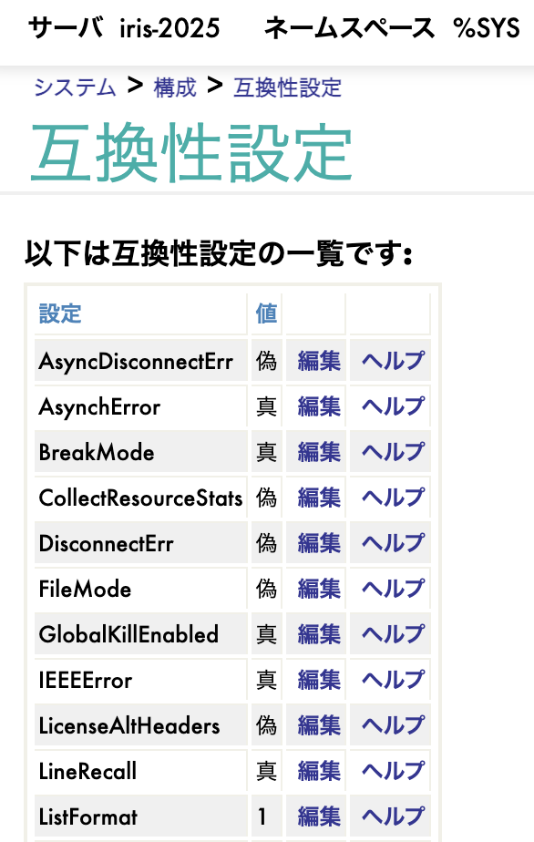
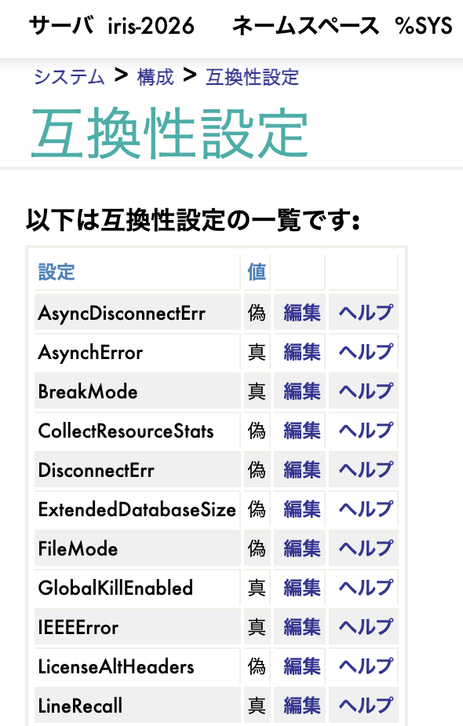
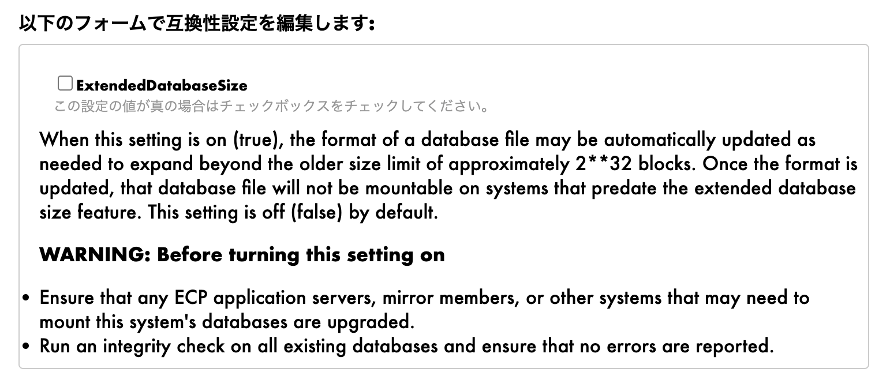

# パフォーマンス改善

## 概要

2025.2から2026.1にかけて、IRISのコアエンジンに複数の改善が加えられました。アプリケーションのコードを書き換えなくても、バージョンを上げるだけで性能向上が得られる改善が揃っています。並行処理のスループット向上（$INCREMENT共有ブロック所有権）、データベースの大容量化（40bitブロック番号による最大8PB対応）、大規模データ削除の高速化（大規模KILL）、そしてIRISTEMPの書き込み特性の安定化です。ひとつずつ、実際に動かしながら効果を確認していきましょう。

---

### $INCREMENT共有ブロック所有権（2026.1）

採番処理でよく使われる`$INCREMENT`の内部実装が改善されました。従来は「ロックを取得し、更新し、解放する」という手順を踏んでいましたが、2026.1ではcompare-and-swap（CAS）命令によるアトミックな更新に変わっています。排他ロックが不要になったことで、**多数のプロセスが同じカウンタを同時に更新する場面でもスループットが大きく伸び**、CPUのコア数に応じてスケールするようになりました。さらにジャーナルレコードにも`SET ($I)` / `SET ($I if greater)`という新しい拡張タイプが加わり、障害復旧時にも採番の挙動を正確に再現できます。

#### 2025.3までと2026.1以降の違い

| 項目 | 2025.3まで（排他ロック） | 2026.1以降（CAS） |
|------|---------------------|-----------------|
| ロック方式 | 排他ロックを取得→更新→解放 | CAS命令でアトミックに更新 |
| 並行アクセス | 他プロセスはロック待ちでブロック | 複数プロセスが同時にアクセス可能 |
| 高並行時 | ロック競合がボトルネック | CASリトライは軽量、スケーラブル |
| ジャーナル | 通常のSETとして記録 | `SET ($I)` / `SET ($I if greater)` として記録 |

#### 確認方法

デモクラス `Demo.Performance.IncrementShared` を使って、100プロセスが一斉に同じグローバルノードへ$INCREMENTを実行するベンチマークを実行してみましょう。カウンタへのアクセスが集中したときの処理性能を確認するシナリオです:

```objectscript
do ##class(Demo.Performance.IncrementShared).Run()
```

#### 考察

注意したいのは、Community版では**同時接続数が8に制限**されている点です。100プロセスをJOBで起動しても、実際に並行実行されるのは最大8プロセスにとどまります。CAS方式の効果が大きく現れるのは、**数十から数百のプロセスが同じノードを同時に更新する環境**です。多数のアプリケーションスレッドが一斉に採番を行うようなフルライセンス版の本番環境で、その差が明確に確認できます。

#### 活用シーン

- セールやイベント開始の瞬間に注文が集中するECサイトやチケットシステムでの採番（注文番号、チケット番号）
- アクセスが集中する高トラフィック環境で、頻繁に更新されるカウンタ

---

### 拡張データベースサイズ（2026.1）

ブロック番号が32bitから40bitへ拡張され、単一データベースで扱える最大サイズが**256倍**に拡大しました。これまでペタバイト級のデータを格納するには、データベースを分割して対応する必要がありました。2026.1以降は**ひとつのデータベースで管理が完結**するため、分割に伴う運用負荷を軽減できます。データ増加が続く環境でも、容量上限を気にせず長期的に運用できるようになりました。

#### 2025.3までと2026.1以降の違い

管理ポータルの「システム > 構成 > 互換性設定」を開くと、2026.1では新たに**ExtendedDatabaseSize**という設定項目が追加されているのが確認できます。

| 2025.1（ExtendedDatabaseSizeなし） | 2026.1（ExtendedDatabaseSize追加） |
|:---:|:---:|
|  |  |

この設定を有効にすると、最大データベースサイズが256倍に拡大します。BlockSizeごとの上限を一覧にすると、拡大の規模が把握できます:

| BlockSize | 2025.3まで（32bit） | 2026.1以降（40bit） | 拡大倍率 |
|-----------|-------------------|-------------------|---------|
| 8 KB | 32 TB | **8 PB** | x256 |
| 16 KB | 64 TB | 16 PB | x256 |
| 64 KB | 256 TB | 64 PB | x256 |

「なぜ64bitではなく40bitなのか」と疑問に思うかもしれません。これは、データ構造の変更を最小限にとどめ、既存のブロックヘッダーとの互換性を保つための設計判断です。8PBという容量は、現時点の実用上ほぼすべての用途で十分なサイズと言えます。

#### 有効化手順

操作はシンプルです。「編集」をクリックし、ExtendedDatabaseSizeのチェックボックスをオンにして保存します。



> **注意:**
> - 有効化後は以前のバージョンとの互換性がなくなります。有効化前のバックアップを推奨し、ECPアプリケーションサーバやミラーメンバーも事前にアップグレードしてください
> - 既存データベースは自動的には拡張されません。新規作成または明示的な変換が必要です

#### 活用シーン

- IoTのセンサーデータやログ集約のように、継続的に蓄積されるペタバイト級データを単一DBで管理する運用
- データベース分割の設計・管理にかかっていた運用負荷の軽減

---

### 大規模KILL改善（2026.1）

巨大なグローバルをKILLする際、従来は「削除のために、まず関連ブロックをすべて読み込む」という処理が避けられませんでした。2026.1では、削除に不要なブロックの物理読み取り（ディスクI/O）をスキップするように改善され、**テーブルのTRUNCATEやバルク削除が大幅に高速化されます**。リモートブロックの読み取りが発生するECP環境では、効果がさらに大きくなります。

#### 2025.3までと2026.1以降の違い

- **2025.3まで**: KILL操作時にすべての関連ブロックを物理読み取りしてから削除
- **2026.1以降**: 不要なブロックの物理読み取りをスキップし、ディスクI/Oを削減

> **注意:** この改善の主な効果は**ディスクI/O（物理読み取り）の削減**です。データがすでにメモリ上にある場合はKILLがほぼ瞬時に完了するため、差は確認しづらくなります。違いが明確に現れるのは、メモリに収まりきらない大規模データを扱う場合や、ECP環境でリモートブロックの読み取りが発生するケースです。

#### 効果の確認方法

残念ながら、データ全体がメモリに収まるデモ環境では、ディスクI/Oの削減は数値として現れません。本番規模での効果を確認したい場合は、`^SystemPerformance`（または `mgstat`）で物理読み取り数（`PhyRds`）を計測しながら大規模KILLを実行する方法が有効です。

```objectscript
// 計測例: KILL前後のディスク読み取り数を比較（%SYS名前空間で実行）
set before = ##class(SYS.Stats.Dashboard).Sample().DiskReads
kill ^Demo.LargeGlobal
set after = ##class(SYS.Stats.Dashboard).Sample().DiskReads
write "ディスク読み取り変化: ", after - before
```

2026.1で計測すると、KILLによって発生するディスク読み取り数が2025.1より減少していることが確認できます。

#### 活用シーン

- 数億行クラスの大規模テーブルを一括削除するTRUNCATE / DROP
- 夜間バッチ完了後に残る一時データの削除
- ECP環境に蓄積された大量データのクリーンアップ

---

### IRISTEMPスパースファイル廃止（2025.2）

IRISTEMPデータベースの形式が、スパースファイルから通常ファイルへ変更されました。スパースファイルは、書き込みのタイミングでOSがディスク領域を動的に割り当てる仕組みです。柔軟性がある一方で、割り当てのタイミングで予期しないI/Oスパイクが発生し、性能のばらつきにつながることがありました。通常ファイルへ変更されたことで、**Write Daemonの処理サイクルが安定し**、I/O挙動の予測精度が向上します。原因の特定が難しい性能のばらつきが減り、性能見積もりの精度を高められます。

#### 2025.1までと2025.2以降の違い

| 項目 | 2025.1まで | 2025.2以降 |
|------|----------|----------|
| IRISTEMPファイル形式 | スパースファイル（動的拡張） | 通常ファイル |
| 初期サイズ | 240 MB | **20 MB** |
| I/O特性 | スパースファイル拡張時にランダムスパイク | 安定した予測可能なI/O |

#### 確認方法

Grafanaダッシュボード（<a href="http://localhost:11715" target="_blank">localhost:11715</a> → IRIS 2026.1メトリクス）を開き、「**Write Daemon**」セクションで `iris_wd_pass`（WDサイクル数）の推移を確認してみましょう。サイクルが乱れず、一定のペースで進んでいる様子が確認できます。

#### 活用シーン

- 大規模ソートやGROUP BYのように、一時テーブルを大量に使う処理を安定して実行したい場合
- I/O性能を高い精度で見積もりたい場合（SLAの遵守や容量計画の立案）

