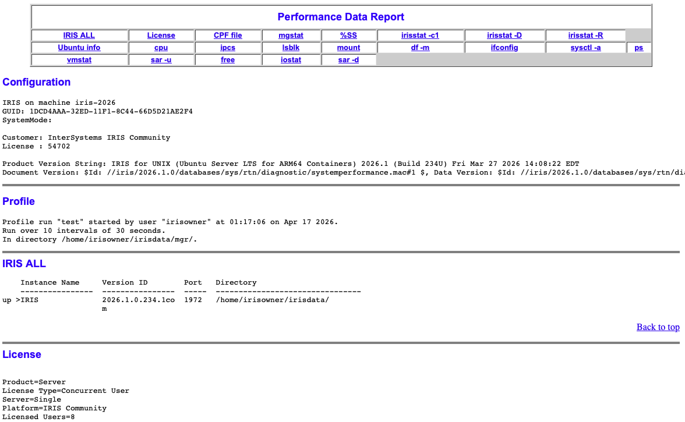
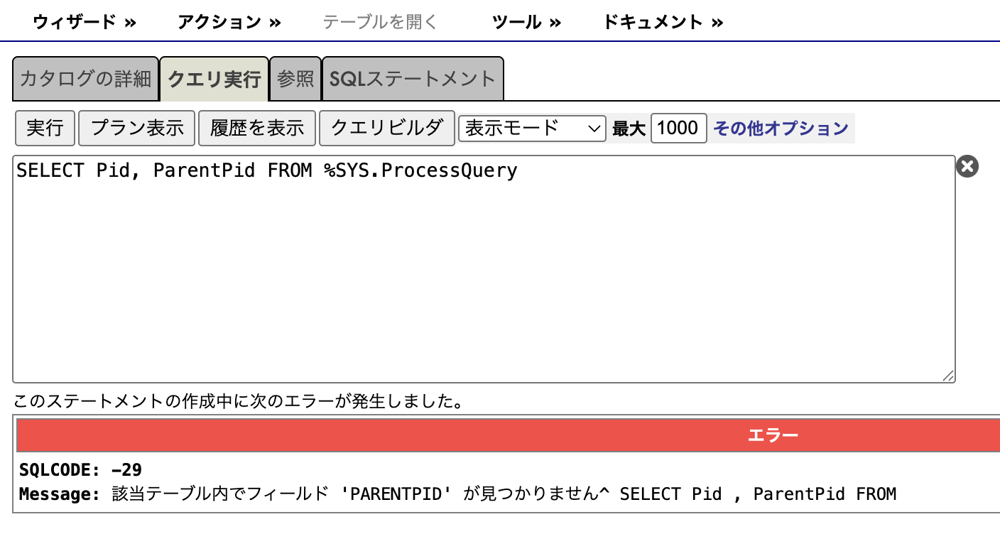
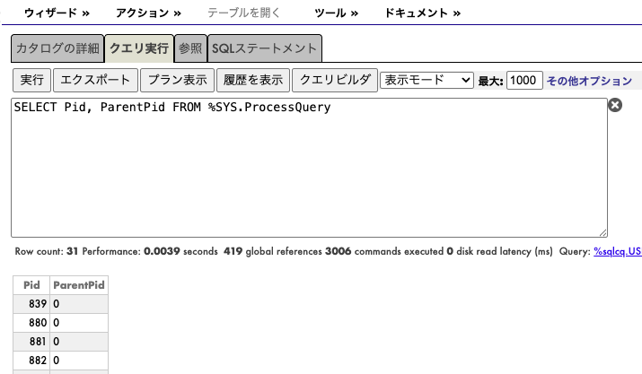
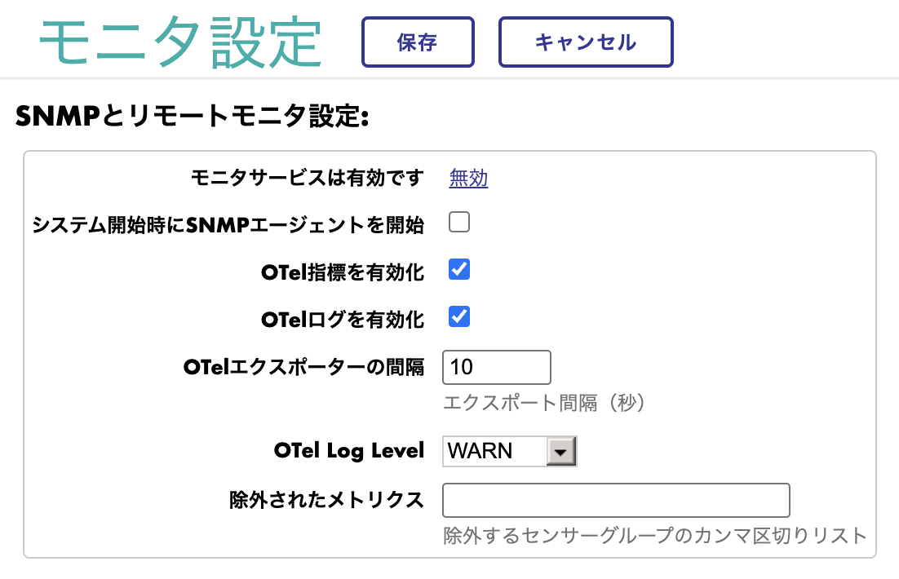
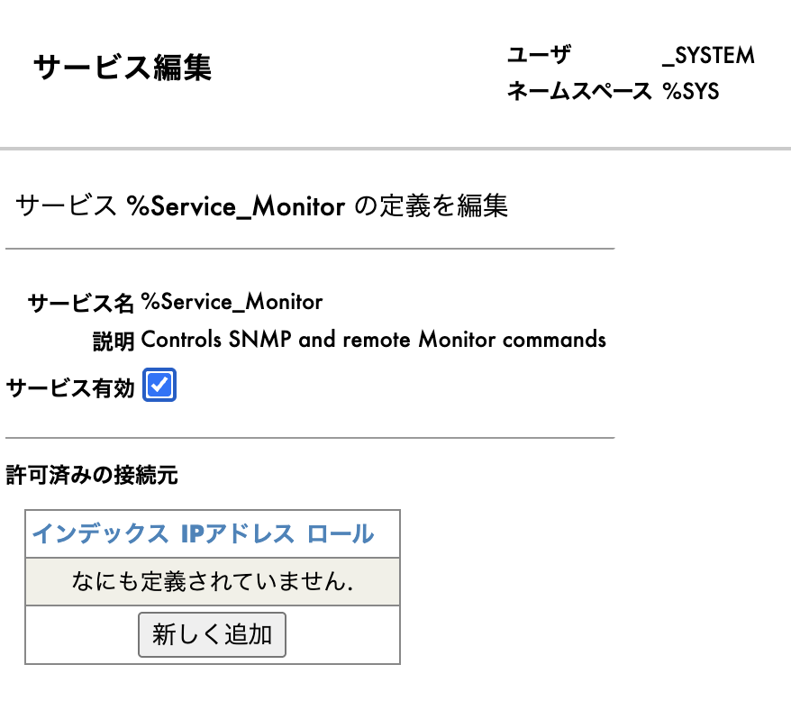
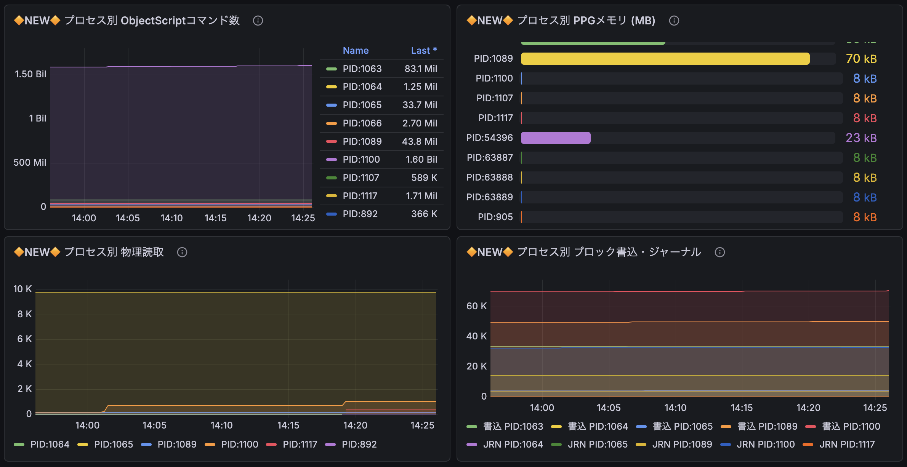

# 監視・可観測性

## 概要

「いま、どのプロセスが何をしているのか」「Write Daemonは正常に動いているか」。これまで断片的にしか見えなかったIRISの内部状態が、2025.3で大きく可視化されました。メトリクスAPI（`/api/monitor/metrics`）とOpenTelemetryから取得できるメトリクスが大幅に拡充され、プロセス単位のリソース消費、ECP/Write Daemonの状態、日次の自動パフォーマンスレポート、SQLから参照できる新しいプロセス情報まで、運用時に把握できる情報量が大きく増えました。実際にエンドポイントへアクセスし、Grafanaのパネルを確認しながら、その内容を見ていきましょう。

> **注**: メトリクスAPIの基本機能は2025.1以前から存在しています。本ドキュメントでは2025.3で追加されたメトリクス（17種）に焦点を当てています。

---

### プロセスメトリクス追加（2025.3）

「システム全体は重いが、どのプロセスが原因か特定できない」。そんなときに役立つのが、プロセスレベルのリソース消費をそのままメトリクスとしてエクスポートする機能です。2025.1ではシステム全体の集計値しか見えませんでしたが、2025.3以降は**プロセス単位でボトルネックを特定**できます。グローバル参照が集中しているプロセス、メモリ使用量が多いプロセスを、一覧から直接確認できます。

| メトリクス名 | 説明 |
|------------|------|
| `iris_process` | プロセス状態（PID、state、jobtype等のラベル付き） |
| `iris_process_glo_refs` | プロセス別グローバル参照数 |
| `iris_process_commands` | プロセス別ObjectScriptコマンド実行数 |
| `iris_process_ppg_size_mb` | プロセス別PPGメモリ使用量（MB） |
| `iris_process_phys_reads` | プロセス別物理読取数 |
| `iris_process_block_writes` | プロセス別ブロック書込数 |
| `iris_process_block_allocs` | プロセス別ブロック割当数 |
| `iris_process_jrn_entries` | プロセス別ジャーナルエントリ数 |

#### 確認方法

ブラウザで2つのエンドポイントを並べて開くと、違いがすぐに確認できます:
- 2025.1: <a href="http://localhost:11702/api/monitor/metrics" target="_blank">localhost:11702/api/monitor/metrics</a>（`iris_process` メトリクスなし）
- 2026.1: <a href="http://localhost:11706/api/monitor/metrics" target="_blank">localhost:11706/api/monitor/metrics</a>（`iris_process_*` メトリクスあり）

グラフで確認したい場合は、Grafanaダッシュボード（<a href="http://localhost:11715" target="_blank">localhost:11715</a>）の「IRIS 2026.1 メトリクス」を開いてください。🔶NEW🔶マーク付きのパネルとして可視化されています。

#### 活用シーン

- 「DBが急に重い」というときに、最も負荷の高いプロセスをリアルタイムで特定できる
- PPGの緩やかな増加傾向から、メモリリークの兆候を早期に検出する

---

### ECPメトリクス（2025.3）

分散キャッシュ環境（ECP）でも、接続状態をメトリクスで確認できるようになりました。サーバーとクライアントの接続数を、数値で把握できます。

| メトリクス名 | 説明 |
|------------|------|
| `iris_ecp_servers` | ECPサーバー接続状態 |
| `iris_ecp_clients` | ECPクライアント接続状態 |

#### 確認方法

ECP環境（ECPサーバー + アプリケーションサーバー構成）で `/api/monitor/metrics` エンドポイントを参照すると、ECP接続が確立されているアプリケーションサーバー側に `iris_ecp_servers`、サーバー側に `iris_ecp_clients` が出力されます。

> **デモ環境について:** このリポジトリのデモ環境は単一IRISインスタンス構成のため、ECPメトリクスは出力されません。ECP構成の本番・検証環境で確認してください。

#### 活用シーン

- ECP接続が切断されたタイミングを検知する（値が0になったらアラート）
- 分散キャッシュ環境全体の状態を、1つのダッシュボードで一元的に把握する

---

### Write Daemonメトリクス（2025.3）

バックグラウンドでデータの書き出しを担うWrite Daemonの動作状況は、これまで外部からほとんど把握できませんでした。2025.3からは専用メトリクスにより、「現在のサイクル数」「書き込みが滞っていないか」をリアルタイムで確認できます。I/Oに関する問題の多くは、これらの値に最初に現れます。

| メトリクス名 | 説明 | 正常時の目安 |
|------------|------|------------|
| `iris_wd_pass` | WDパス数（起動からの累計サイクル） | 単調増加していること |
| `iris_wd_phase` | 現在のフェーズ | 特定値に張り付いていないこと |
| `iris_wd_condition` | ブロック条件フラグ | 0が継続すること |
| `iris_wd_suspended` | 一時停止状態 | 0であること |

#### 確認方法

Grafanaダッシュボード（<a href="http://localhost:11715" target="_blank">localhost:11715</a> → IRIS 2026.1メトリクス）の「**Write Daemon**」セクションを開くと、上記メトリクスの時系列推移を確認できます。`iris_wd_pass` のグラフが継続的に増加していれば、WDはサイクルを正常に処理できている状態です。一方、`iris_wd_condition` が0以外の値で停滞している場合は、I/Oが滞留している可能性を示しています。

#### 活用シーン

- サイクル時間を確認しながらWDをチューニングし、書き込み遅延を平準化する
- `iris_wd_condition` が継続的に0以外を示す状況から、I/Oボトルネックを早期に検出する

---

### 日次システムパフォーマンスレポート（2025.3）

`^SystemPerformance`ユーティリティは、IRISとOSの性能情報を一括で収集し、1つのHTMLレポートとして出力するユーティリティです。2025.3では`SystemPerformanceDailyReportsOn`設定が追加され、**追加の操作なしに、その日のレポートが毎日自動で生成される**ようになりました。障害発生時に「前日との差分」を比較したり、数週間分のトレンドを後から確認したりと、運用面で活用できる場面の多い機能です。

#### 2025.2までと2025.3以降の違い

- **2025.2まで**: 基本的に手動実行。日次運用する場合は、管理ポータルのタスクマネージャに個別にスケジュールを設定する必要があった
- **2025.3以降**: `SystemPerformanceDailyReportsOn=1`を設定するだけで、IRISが毎日自動で実行する

#### 設定方法（自動日次レポート）

`merge.cpf`（または管理ポータル → 構成 → 追加設定）に次の1行を追加すると有効化されます:
```ini
[config]
SystemPerformanceDailyReportsOn=1
```

#### 確認方法（手動実行）

自動実行を待たずに動作を確認したい場合は、IRISターミナルの `%SYS` 名前空間で手動実行できます:

```objectscript
// メニュー表示（プロファイル選択）
do ^SystemPerformance

// または、プログラムから直接実行（戻り値は run ID）
set runId = $$run^SystemPerformance("test")
// → 例: "20260417_011706_test"

// サンプリング完了後、HTMLレポートを生成
set ret = $$Collect^SystemPerformance(runId)
// → 1 = 成功、0 = 失敗
// HTMLは <hostname>_<instance>_<runId>.html としてmgr/に出力される
```

**利用可能なプロファイル:**

| プロファイル | 実行時間 | サンプリング間隔 | 用途 |
|------------|---------|----------------|------|
| `test` | 5分 | 30秒 | 動作確認用 |
| `30mins` | 30分 | 1秒 | 短時間の高解像度分析 |
| `4hours` | 4時間 | 5秒 | ピーク時間帯の調査 |
| `8hours` | 8時間 | 10秒 | 業務時間帯の分析 |
| `12hours` | 12時間 | 10秒 | 半日分の分析 |
| `24hours` | 24時間 | 10秒 | 日次レポート（自動実行はこれ） |

#### レポート内容

`$$Collect^SystemPerformance` で集計すると、`<hostname>_<instance>_<runId>.html`が`mgr/`ディレクトリに生成されます。1つのファイルに、IRIS内部からOSレベルまで、以下の情報が一通り集約されます:

| カテゴリ | 収集情報 |
|---------|---------|
| **IRIS全般** | IRISバージョン、ライセンス、CPF設定 |
| **IRISパフォーマンス** | mgstat（グローバル参照、ジャーナル等）、`^%SS`プロセス情報 |
| **IRIS内部統計** | irisstat -c1 / -D（データベース統計） / -R（リソース） |
| **OS情報** | OS情報、CPU、メモリ、ディスク、IPC、マウント状況、ifconfig |
| **リアルタイム計測** | vmstat、sar -u（CPU）、sar -d（ディスク）、iostat、free（メモリ）、ps |

**レポート例（Community版2026.1で生成）:**



実際のレポートは、`generate-sysperf.sh` を実行すると `opt/iris/sysperf-report.html` としてホスト側に出力されます。ブラウザで開いて内容を確認してみてください。

ページ上部には各セクションへのジャンプリンク（IRIS ALL / License / CPF file / mgstat / %SS / irisstat / vmstat / sar -u / iostat 等）が配置されており、目的の情報にすぐ移動できます。本文はConfiguration（IRISインスタンス情報）、Profile（実行情報）、各種メトリクスデータの順に並んでいます。

#### 出力先

出力先のデフォルトは IRIS インストールディレクトリの `mgr/` です（コンテナでは `/home/irisowner/irisdata/mgr/`）。サンプリング実行中は `<runId>_<n>.log` という分割ログが順次出力され、最後に `$$Collect` を実行すると、それらが1つのHTMLレポートに集約されます。

#### 活用シーン

- 日次で蓄積されるレポートから、性能の緩やかな変化を長期トレンドとして分析する
- 障害発生前後のレポートを比較し、メモリ・CPU・I/Oのスパイクが発生した箇所を特定する
- チューニング前後のベースラインを取得し、効果を数値で評価する
- InterSystemsサポートへ問題を報告する際に、状況を裏づける添付資料として活用する

---

### %SYS.ProcessQuery新プロパティ（2025.3）

プロセス情報に`ParentPid`（親プロセスID）と`StartTimeUTC`（UTC開始時刻）が追加されました。これまで親子関係の追跡や起動時刻の確認には手間がかかっていましたが、2025.3以降は**1本のSQLで取得**できます。JOBで起動した子プロセスのツリー構造の確認や、長時間稼働しているプロセスの抽出が、通常のSQLクエリで実現できるようになりました。

#### 2025.2までと2025.3以降の違い

**2025.2まで:** `%SYS.ProcessQuery`には親プロセスIDも開始時刻も存在せず、次のクエリはエラーとなっていました:

```sql
SELECT Pid, ParentPid FROM %SYS.ProcessQuery
```


**2025.3**以降は、同じクエリがそのまま通ります。



<br>

親子関係と経過時間が参照できるようになると、次のようなクエリが書けます:

```sql
-- 現在のプロセス情報
SELECT TOP 5 Pid, UserName, ParentPid, StartTimeUTC
FROM %SYS.ProcessQuery ORDER BY Pid

-- 特定プロセスの子プロセスを検索
SELECT Pid, ParentPid, StartTimeUTC, UserName
FROM %SYS.ProcessQuery WHERE ParentPid = 12345

-- 長時間実行プロセスの検出
SELECT Pid, UserName, StartTimeUTC,
  DATEDIFF('ss', StartTimeUTC, CURRENT_TIMESTAMP) AS RunningSeconds
FROM %SYS.ProcessQuery ORDER BY StartTimeUTC
```

#### 活用シーン

- JOBで起動した子プロセスを親プロセスから追跡し、ツリー全体を把握する
- 想定より長時間稼働しているプロセスを抽出し、通知処理に組み込む
- プロセスの起動時刻を起点に、日次の運用監視を構築する

---

### OpenTelemetry / メトリクスの有効化

#### 管理ポータルでの設定（推奨）

ここまで紹介したメトリクスをOpenTelemetryでエクスポートするには、まず管理ポータルの **システム管理 → 構成 → 追加設定 → モニタ** を開きます。



以下の項目を設定します:

**手順1:** 「モニタサービスは無効です」の横にある「**有効**」リンクをクリックすると、`%Service_Monitor`のサービス編集画面が開きます。「**サービス有効**」にチェックを入れて保存します。



**手順2:** モニタ設定画面に戻り、以下を設定して**保存**をクリックします:

| 項目 | 設定値 | 説明 |
|------|--------|------|
| OTel指標を有効化 | **チェック** | OpenTelemetryメトリクスのエクスポートを有効化 |
| OTelログを有効化 | チェック（任意） | OpenTelemetryログのエクスポートを有効化 |
| OTelエクスポーターの間隔 | 10（デフォルト） | メトリクスのエクスポート間隔（秒） |

> **参考:** [Emit Telemetry Data to an OpenTelemetry-Compatible Monitoring Tool（公式ドキュメント）](https://docs.intersystems.com/irislatest/csp/docbook/DocBook.UI.Page.cls?KEY=AOTEL)

#### merge.cpf / CPFファイルでの設定

自動デプロイやスクリプトで設定をコード管理する場合は、`[Monitor]`セクションに次の数行を追加します:

```ini
[Monitor]
OTELMetrics=1
OTELLogs=1
OTELInterval=10
```

送信先となるOTLPエンドポイント（OTelコレクター）は、環境変数 `OTEL_EXPORTER_OTLP_ENDPOINT` で指定します。

#### Grafanaダッシュボード

送信先は柔軟に選択できます。Grafana + Prometheus（OSSスタック）、Datadog、New Relicなど、OTLPに対応したバックエンドであれば任意のものに送信できます。

ローカル環境で動作を確認したい場合は、本リポジトリにGrafanaダッシュボード（<a href="http://localhost:11715" target="_blank">localhost:11715</a>、admin/admin）を用意しています。左側のツリーからDashboardsをクリックし、IRISフォルダ内の **IRIS 2026.1メトリクス** を開いてください。

🔶NEW🔶マークの付いたパネルが、2025.3で新たに追加された監視メトリクスです。まずはそれらを確認すると、今回の拡充内容の全体像を把握できます。

