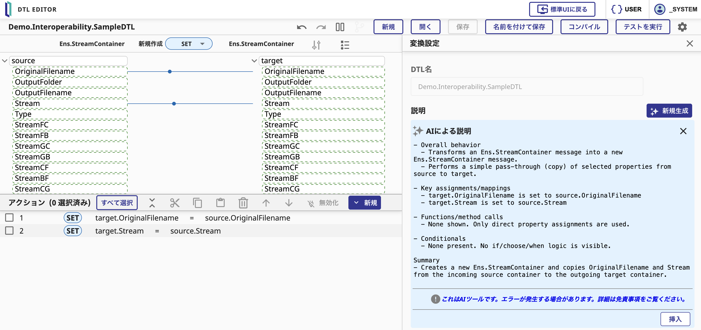

# Interoperability

## 概要

2025.3/2026.1では、Interoperability（統合プラットフォーム）の使い勝手と性能が大きく向上しました。長年「順序を取るか、速度を取るか」の二者択一だったメッセージ処理は、FIFOメッセージグループ（2025.3）で両立できるようになりました。さらにBPLエディタやメッセージビューアといった日常的に利用する画面が刷新され（UIモダナイゼーション、2025.3/2026.1）、複雑なDTLをAIが解析して説明するDTL AI Explain（2026.1）、Mirth ConnectからIRISへの移行を支援するマイグレーションツール（2026.1）も加わりました。開発者にとっても運用者にとっても価値のある更新です。ここからは一つずつ順に見ていきます。

## 変更点の詳細

### FIFOメッセージグループ（2025.3/2026.1）

Business OperationやBusiness ProcessのPoolSizeを2以上に増やしても、同一グループ内のメッセージ順序（FIFO）が保持される機能です。これまでは「順序保証かスループットか」のどちらかを諦める必要がありましたが、FIFOメッセージグループによって**両立が可能**になりました。コードの書き換えは不要で、**設定のみで導入**できます。既存のプロダクションにも後から適用できる点が利点です。

**従来の課題**:
- PoolSize=1: FIFO順序は保証されるが、スループットが低い
- PoolSize>1: スループットは向上するが、メッセージの処理順序が保証されない

**FIFOメッセージグループの解決策**:
- 同一グループ（例: 患者ID）のメッセージは同じワーカーが順番どおりに直列処理（順序保証）
- 別のグループのメッセージは空いている別ワーカーが並行処理（スループット向上）

「グループ単位では一列、全体では複数レーン」という考え方です。動作イメージは次のとおりです:
```
受信メッセージ: [A1] [A2] [B1] [A3] [B2] [C1]

ワーカー1（患者A）: A1 → A2 → A3  （順序保証）
ワーカー2（患者B）: B1 → B2        （順序保証）
ワーカー3（患者C）: C1             （独立）
ワーカー4:          待機            （新グループ発生時に使用）

→ 全体スループットは最大4倍に向上
→ 各患者のメッセージ順序は完全に保証
```

#### 設定方法

設定は管理ポータル上で完結します。プロダクション（**Interoperability > 構成 > プロダクション**）を開き、対象ビジネスホストの設定画面で次の項目を指定します:

| 設定項目 | 説明 |
|---------|------|
| **PoolSize** | 並行ワーカー数（例: 4）。CPUコア数に合わせて設定 |
| **FMGCalculation** | グループIDを計算するDTLクラス名。対象タイプ `Ens.Queue.FIFOMessageGroup` のDTLを作成し、クラス名を指定 |
| **FMGCompletionHosts**（任意） | グループのリリースを許可するビジネスホスト名のカンマ区切りリスト |

**DTLの設定**: 中心となるのは `FMGCalculation` に指定するDTLです。ターゲット（`Ens.Queue.FIFOMessageGroup`）の `Identifier` プロパティに、「同じグループ」とみなす基準（例: 患者ID）をマッピングします。どのグループにも属させたくないメッセージには `$$$EnsFMGSingleThreadIdentifier` を割り当てると、そのメッセージのみシングルスレッドで処理されます。

> **参考:** [Maintaining First-In First-Out (FIFO) Processing（公式ドキュメント）](https://docs.intersystems.com/irislatest/csp/docbook/DocBook.UI.Page.cls?KEY=ECONFIG_maintfifo)

#### 確認方法

設定後、実際にメッセージを流して動作を確認します。**Interoperability > 表示 > メッセージ** のメッセージビューアを開くと、各メッセージがどのFIFOグループに属し、どのメッセージに依存しているかを確認できます。2026.1の新UIに切り替えると（「**新しいUIを試す**」ボタン）、FIFOグループの関係がビジュアル表示され、順序保証の仕組みを直感的に把握できます。

#### 活用シーン

- 医療: 患者ごとのHL7/FHIRメッセージを取り違えることなく、入院・検査・退院の流れを正しい順序で高速に処理する
- 金融: 口座単位で入出金トランザクションの前後関係を維持しつつ、全体の処理量を確保する
- IoT: 大量のデバイスから届くセンサーデータを、デバイスごとの時系列を保ったまま並行処理する

---

### UIモダナイゼーション（2025.3/2026.1）

日常的に利用するInteroperabilityの管理画面が、段階的に刷新されています。一斉に置き換えるのではなく、各画面に「**新しいUIを試す**（Try the new UI）」ボタンが用意されており、新旧UIを任意のタイミングで切り替えられます（強制移行はありません）。気になった画面から試し、必要に応じて旧UIに戻す運用が可能です。

#### BPLエディタの改善（2026.1）

**管理ポータル → Interoperability > 構成 > BPLプロセス > [プロセス名]** でBPLを開き、「**新しいUIを試す**」をクリックすると新UIに切り替わります。編集機能が全体的に強化されています。

主な改善点:
- ツリービューで全アクションを一覧表示。ループ内のネスト構造も俯瞰できる
- Assign・Conditionの入力中にオートコンプリートが動作し、タイプミスが減る
- アンドゥ/リドゥに完全対応し、試行錯誤しながら編集できる
- VS Code（InterSystems ObjectScript拡張）から直接編集することも可能

#### メッセージビューアの改善（2026.1）

**管理ポータル → Interoperability > 表示 > メッセージ** で「**新しいUIを試す**」をクリックすると新UIに切り替わります。トラブル調査でメッセージを追跡する場面で特に有用です。

主な改善点:
- よく使う検索条件を保存して再利用でき、同じ絞り込みを毎回入力する手間が省ける
- FIFOグループをビジュアル表示し、グループIDや依存関係をその場で確認できる
- フィルタリング・絞り込みが強化され、目的のメッセージへ素早く到達できる

#### プロダクション構成UIの改善（2025.3/2026.1）

**管理ポータル → Interoperability > 構成 > プロダクション > [プロダクション名]** で「**新しいUIを試す**」をクリックすると新UIに切り替わります。ホスト数が増えるほど扱いにくくなっていた構成画面の視認性が大きく改善しています。

主な改善点（2025.3〜2026.1の累積）:
- ホストごとのPoolSizeが一覧で確認でき、全体のリソース配分を把握しやすい
- ホスト名・プロパティ・IPアドレスなどで全ホストを横断検索でき、目的のホストへすぐに到達できる
- セクションを一括で展開／折りたたみでき、長いリストでも目的地を見失わない
- 2,000ホストを超える大規模プロダクションでも快適に動作する

#### 確認方法

違いを把握するには、両バージョンを並べて比較するのが効果的です。2025.1（<a href="http://localhost:11702" target="_blank">localhost:11702</a>）と2026.1（<a href="http://localhost:11706" target="_blank">localhost:11706</a>）の管理ポータルを並べて見比べてみてください。サンプルプロダクション `Demo.Interoperability.SampleProduction` でプロダクション構成UIを、`Demo.Interoperability.SampleBPL` / `SampleDTL` でBPL/DTLエディタの改善内容を、それぞれ確認できます。

---

### DTL AI Explain（2026.1）

「このDTLは何を変換しているのか」を素早く把握したい場面で役立つのが、2026.1のDTLエディタに追加された**AIによる変換ロジックの自動説明機能**です。OpenAI APIがDTLの内容を解析し、自然言語による説明文を生成します。他のメンバーが作成した複雑なマッピングや、過去に自分が書いたDTLの内容を、ボタン操作だけで再確認できます。仕様の理解やドキュメント作成の双方に活用できる機能です。

#### 設定方法

利用にあたって、OpenAI APIキーをセキュリティウォレットに登録しておきます。IRISターミナルの`%SYS`名前空間で、以下のコマンドを順に実行してください:

```objectscript
zn "%SYS"

// 1. リソース作成
set sc = ##class(Security.Resources).Create("DTLExplainResource")

// 2. ウォレットコレクション作成
set sc = ##class(%Wallet.Collection).Create("%DTLExplain", {"Resource":"DTLExplainResource"})

// 3. OpenAI APIキーを登録
set sc = ##class(%Wallet.KeyValue).Create("%DTLExplain.Key", {"Secret":{"token":"<OpenAI APIキーをここに入力>"}, "Usage":["HTTP"]})
```

> **参考:** [Configuring the DTL Explainer（公式ドキュメント）](https://docs.intersystems.com/iris20261/csp/docbook/Doc.View.cls?KEY=EDTL_configexplainer)

#### 使い方

1. DTLエディタで変換クラスを開く（例: `Demo.Interoperability.SampleDTL`）
2. 「**新しい UI で開く**」ボタンで新UIに切り替える
3. 右上の**歯車アイコン（⚙）**をクリックして「Transform Settings」を開く
4. Descriptionフィールドの横にある「**✨ Generate New**」ボタンをクリック
5. 完了を待つ。AIが変換ロジックを解析し、説明文を生成します



> **注意:** 現時点では生成される説明文は**英語のみ**です。

#### 活用シーン

- 引き継いだばかりで作成者が不明な複雑なDTLの内容を素早く把握する
- 仕様書の下書きとして、DTLの説明文をまとめて生成する
- コードレビューで、変換が意図どおりか説明文と照合して確認する

---

### Mirthマイグレーションツール（2026.1）

Mirth Connect（NextGen Connect）からIRIS Interoperabilityへの移行を支援するHL7マイグレーションツールが、2026.1で提供されました。手作業での移植が大きな負担となるMirthのHL7変換ルールを、IRISのDTLクラスとルックアップテーブルへ自動で変換します。移行作業の初期段階を効率化できる機能です。

#### アクセス方法

起点となるのは管理ポータルの **管理 > HL7生産性ツール > HL7マイグレーションツール** です。ここから一連の移行作業を開始できます。

> **事前要件:** Java Runtime Environment（JRE）がサーバーにインストールされていること。

#### 移行手順の概要

1. 作業用の基盤として、HSLIBネームスペースをもとにIRISインスタンスへ新しいネームスペースを作成します
2. HL7マイグレーションツールを開き、移行元となるMirthの変換ファイルを指定します
3. 生成するDTLクラス名（`/ClassName`）と、ソースメッセージのDocType（`/SourceDocType`）を設定します
4. 変換を実行し、生成されたDTLクラスとルックアップテーブルを確認します

> **注意:** このツールが対象とするのはHL7→HL7変換です。Mirthの全機能を一括で移行できるわけではなく、変換後のDTLには手作業による調整が必要になる場合があります。移行作業の出発点を整えるためのツール、という位置づけで利用するのが適切です。

> **参考:** [HL7 Migration Tool（公式ドキュメント）](https://docs.intersystems.com/irisforhealthlatest/csp/docbook/DocBook.UI.Page.cls?KEY=EHL7T_migration)

#### 活用シーン

- Mirth ConnectからIRIS Interoperabilityへ、段階的に移行を進める
- これまで蓄積してきたHL7変換ロジックを、IRISのDTLとして資産化する
- 本格移行の前に、自動変換できる範囲と手作業が必要な範囲を見積もる
